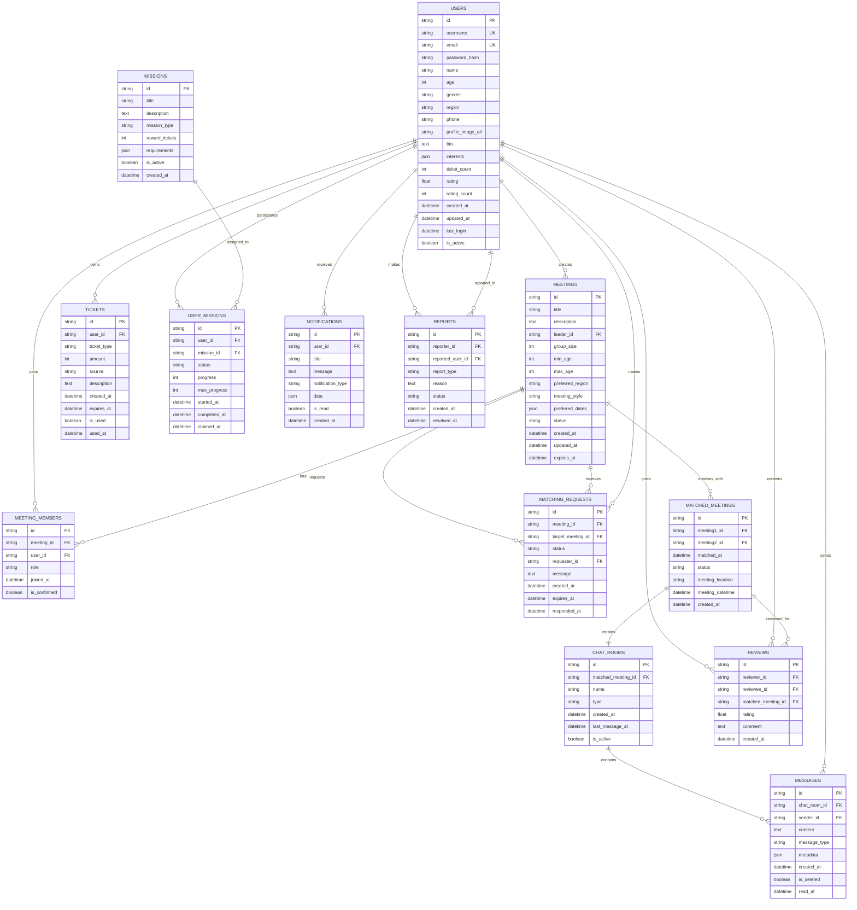

# 멀팅 앱 데이터베이스 ERD

## 테이블 설명

### 핵심 테이블
1. **USERS**: 사용자 기본 정보 및 프로필
2. **MEETINGS**: 미팅 신청 정보
3. **MEETING_MEMBERS**: 미팅 참가자 관리
4. **MATCHING_REQUESTS**: 미팅 간 매칭 요청
5. **MATCHED_MEETINGS**: 성사된 매칭 정보

### 부가 기능 테이블
6. **CHAT_ROOMS & MESSAGES**: 실시간 채팅
7. **TICKETS & MISSIONS**: 게임화 요소
8. **REVIEWS**: 사용자 평가 시스템
9. **NOTIFICATIONS**: 푸시 알림 관리
10. **REPORTS**: 신고 및 관리 시스템

이 ERD를 기반으로 PostgreSQL 스키마를 생성할 수 있습니다.
